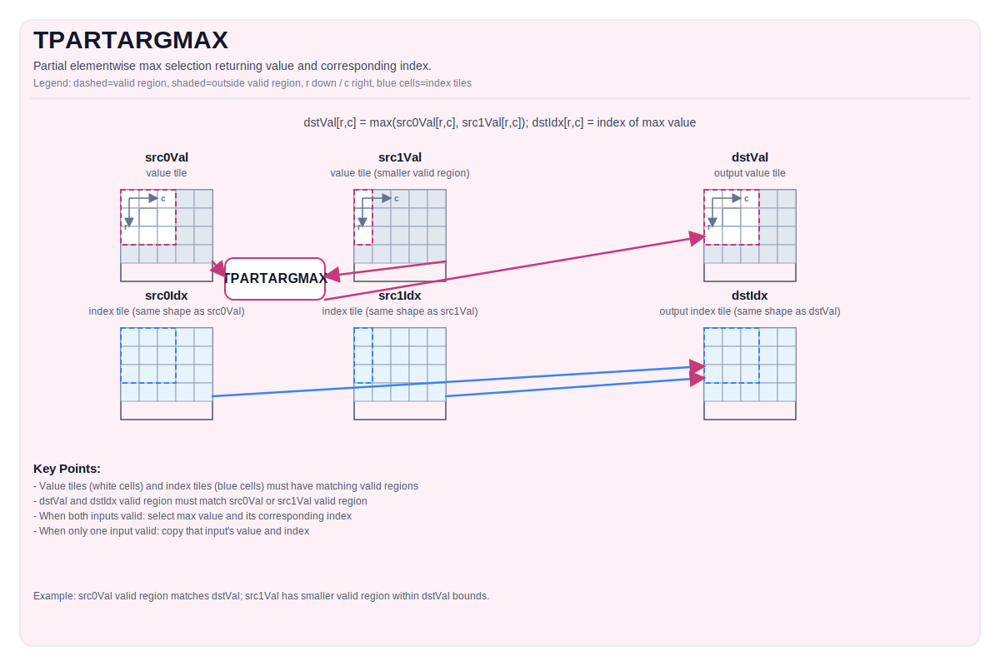

# TPARTARGMAX

## 指令示意图



## 简介

在目标有效区域内执行逐元素最大值选择，并同时返回对应的索引值。若某个位置上 `src0Val` 和 `src1Val` 都有效，则结果值为 `max(src0Val, src1Val)`，结果索引为最大值对应的源索引；若只有一个输入在该位置有效，则结果直接取该输入的值和索引。其余有效区域不匹配的情况由具体实现定义。

## 数学语义

对目标有效区域内的每个元素 `(i, j)`：

$$
\begin{aligned}
(\mathrm{dstVal}_{i,j}, \mathrm{dstIdx}_{i,j}) =
\begin{cases}
(\mathrm{src0Val}_{i,j}, \mathrm{src0Idx}_{i,j}) & \text{若 } \mathrm{src0Val}_{i,j} > \mathrm{src1Val}_{i,j} \text{ 且两个输入在 } (i,j) \text{ 处均有定义} \\
(\mathrm{src1Val}_{i,j}, \mathrm{src1Idx}_{i,j}) & \text{若 } \mathrm{src1Val}_{i,j} \ge \mathrm{src0Val}_{i,j} \text{ 且两个输入在 } (i,j) \text{ 处均有定义} \\
(\mathrm{src0Val}_{i,j}, \mathrm{src0Idx}_{i,j}) & \text{若仅 src0 在 } (i,j) \text{ 处有定义} \\
(\mathrm{src1Val}_{i,j}, \mathrm{src1Idx}_{i,j}) & \text{若仅 src1 在 } (i,j) \text{ 处有定义}
\end{cases}
\end{aligned}
$$

## 汇编语法

PTO-AS 形式：参见[汇编模型](syntax-and-operands/assembly-model_zh.md)。

同步形式：

```text
%dstVal, %dstIdx = tpartargmax %src0Val, %src1Val, %src0Idx, %src1Idx : !pto.tile<...> -> (!pto.tile<...>, !pto.tile<...>)
```

### AS Level 1（SSA）

```text
%dstVal, %dstIdx = pto.tpartargmax %src0Val, %src1Val, %src0Idx, %src1Idx : (!pto.tile<...>, !pto.tile<...>, !pto.tile<...>, !pto.tile<...>) -> (!pto.tile<...>, !pto.tile<...>)
```

### AS Level 2（DPS）

```text
pto.tpartargmax ins(%src0Val, %src1Val, %src0Idx, %src1Idx : !pto.tile_buf<...>, !pto.tile_buf<...>, !pto.tile_buf<...>, !pto.tile_buf<...>) outs(%dstVal, %dstIdx : !pto.tile_buf<...>, !pto.tile_buf<...>)
```

## C++ 内建接口

声明于 `include/pto/common/pto_instr.hpp`：

```cpp
template <typename TileDataDst, typename TileDataSrc0, typename TileDataSrc1,
          typename TileDataDstIdx, typename TileDataSrc0Idx, typename TileDataSrc1Idx,
          typename... WaitEvents>
PTO_INST RecordEvent TPARTARGMAX(TileDataDst &dstVal, TileDataSrc0 &src0Val, TileDataSrc1 &src1Val,
                                 TileDataDstIdx &dstIdx, TileDataSrc0Idx &src0Idx, TileDataSrc1Idx &src1Idx,
                                 WaitEvents &... events);
```

## 约束

!!! warning "约束"
    ### 通用约束或检查

    - `dstVal`、`src0Val` 和 `src1Val` 的元素类型必须一致。
    - `dstIdx`、`src0Idx` 和 `src1Idx` 的元素类型必须一致。
    - 值类型与索引类型的组合约束：
        - 若值类型为 `half`，则索引类型必须为 `int16_t` 或 `uint16_t`。
        - 若值类型为 `float`，则索引类型必须为 `int32_t` 或 `uint32_t`。
    - 每对值 Tile 和索引 Tile 的有效区域必须一致：
        - `src0Val` 与 `src0Idx` 的有效区域必须一致。
        - `src1Val` 与 `src1Idx` 的有效区域必须一致。
        - `dstVal` 与 `dstIdx` 的有效区域必须一致。
    - 目标有效区域必须与 `src0Val` 或 `src1Val` 之一的有效区域完全一致。
    - 若 `dstVal` 的有效区域为零，指令直接返回。
    - 对目标有效区域内的每个元素：
        - 若两个输入都有效，则执行逐元素最大值运算，并返回较大值对应的索引；
        - 若只有一个输入有效，则结果直接取该输入的值和索引。
    - 上述范围之外的有效区域组合，其行为均由具体实现定义。

    ### A5 实现检查

    - 支持的值类型：`half`、`float`。
    - 支持的索引类型：`int16_t`、`uint16_t`、`int32_t`、`uint32_t`。

## 示例

### 自动（Auto）

```cpp
#include <pto/pto-inst.hpp>

using namespace pto;

void example_auto() {
  using ValTileT = Tile<TileType::Vec, float, 16, 16>;
  using IdxTileT = Tile<TileType::Vec, int32_t, 16, 16>;
  ValTileT src0Val, src1Val, dstVal;
  IdxTileT src0Idx, src1Idx, dstIdx;
  TPARTARGMAX(dstVal, src0Val, src1Val, dstIdx, src0Idx, src1Idx);
}
```

### 手动（Manual）

```cpp
#include <pto/pto-inst.hpp>

using namespace pto;

void example_manual() {
  using ValTileT = Tile<TileType::Vec, float, 16, 16>;
  using IdxTileT = Tile<TileType::Vec, int32_t, 16, 16>;
  ValTileT src0Val, src1Val, dstVal;
  IdxTileT src0Idx, src1Idx, dstIdx;
  TASSIGN(src0Val, 0x1000);
  TASSIGN(src1Val, 0x2000);
  TASSIGN(dstVal,  0x3000);
  TASSIGN(src0Idx, 0x4000);
  TASSIGN(src1Idx, 0x5000);
  TASSIGN(dstIdx,  0x6000);
  TPARTARGMAX(dstVal, src0Val, src1Val, dstIdx, src0Idx, src1Idx);
}
```

## 汇编示例（ASM）

### 自动模式

```text
# 自动模式：由编译器/运行时负责资源放置与调度。
%dstVal, %dstIdx = pto.tpartargmax %src0Val, %src1Val, %src0Idx, %src1Idx : (!pto.tile<...>, !pto.tile<...>, !pto.tile<...>, !pto.tile<...>) -> (!pto.tile<...>, !pto.tile<...>)
```

### 手动模式

```text
# 手动模式：先显式绑定资源，再发射指令。
# 可选（当该指令包含 tile 操作数时）：
# pto.tassign %arg0, @tile(0x1000)
# pto.tassign %arg1, @tile(0x2000)
%dstVal, %dstIdx = pto.tpartargmax %src0Val, %src1Val, %src0Idx, %src1Idx : (!pto.tile<...>, !pto.tile<...>, !pto.tile<...>, !pto.tile<...>) -> (!pto.tile<...>, !pto.tile<...>)
```

### PTO 汇编形式

```text
%dstVal, %dstIdx = tpartargmax %src0Val, %src1Val, %src0Idx, %src1Idx : !pto.tile<...> -> (!pto.tile<...>, !pto.tile<...>)
# AS Level 2 (DPS)
pto.tpartargmax ins(%src0Val, %src1Val, %src0Idx, %src1Idx : !pto.tile_buf<...>, !pto.tile_buf<...>, !pto.tile_buf<...>, !pto.tile_buf<...>) outs(%dstVal, %dstIdx : !pto.tile_buf<...>, !pto.tile_buf<...>)
```
